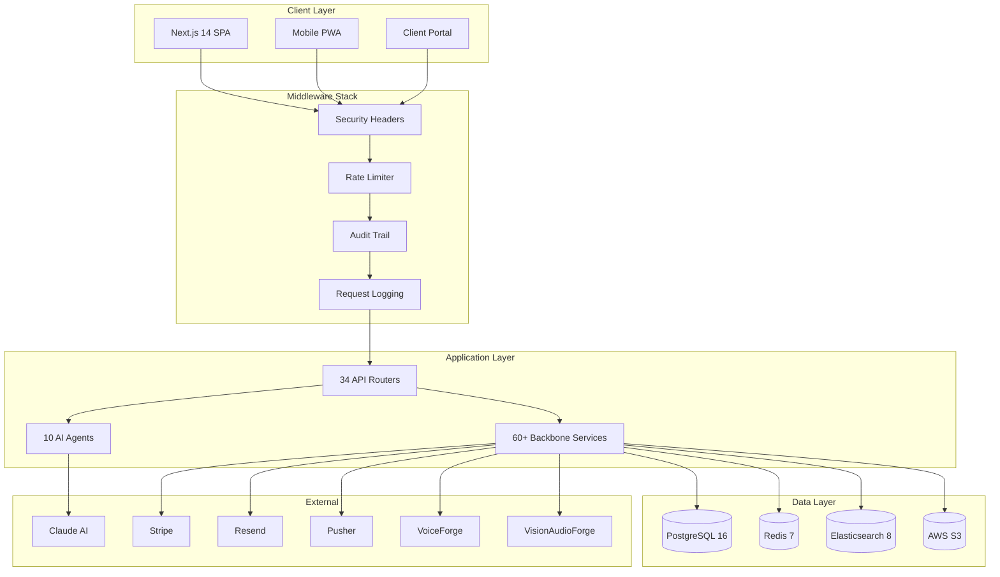

  

# ChamberForge

The world's first complete premium-service operating system for entrepreneurs and boutique firms serving HNW/UHNW individuals and families. ChamberForge combines 112 purpose-built modules, 10 AI agents, and 10 vertical playbooks into a single platform that takes a premium service firm from problem discovery through client delivery and retention. Three integrated platforms -- ChamberForge Core, VoiceForge, and VisionAudioForge -- provide full-stack coverage across text, voice, and visual channels.

**112 Modules | 10 AI Agents | 10 Vertical Playbooks | 3 Integrated Platforms | 348 API Endpoints**

---

## Architecture



---

## Quick Start

### Docker (Recommended)

```bash
git clone https://github.com/navigreen311/ChamberForge.git
cd ChamberForge

# Start infrastructure services
docker compose up -d

# Environment
cp .env.example .env
# Fill in: DATABASE_URL, REDIS_URL, JWT_SECRET, ANTHROPIC_API_KEY, STRIPE_SECRET_KEY, RESEND_API_KEY
```

### One Command Start

```bash
docker compose -f docker-compose.dev.yml up
```

This starts all infrastructure services, the backend API, and the frontend dev server in a single command.

### Backend (FastAPI)

```bash
cd backend
python -m venv .venv
source .venv/bin/activate        # Windows: .venv\Scripts\activate
pip install -r requirements.txt

# Run migrations
alembic upgrade head

# Seed data (10 playbooks, demo workspace, sample problems/offers)
python -m scripts.seed

# Start server
uvicorn app.main:app --reload --port 8000
```

### Frontend (Next.js)

```bash
cd frontend
npm install
npm run dev
```

Open http://localhost:3000

### Seed Data

The seed script populates:
- 1 demo workspace with admin user (`admin@chamberforge.dev` / `changeme`)
- 10 vertical playbooks with full ICP, pricing, SOP, and KPI data
- Sample problems, evidence, offers, and clients
- Feature flags and entitlement plans

---

## Project Structure

```
ChamberForge/
├── frontend/                    # Next.js 14 + TypeScript + Tailwind CSS
│   └── src/
│       ├── app/                 # App Router pages
│       ├── components/          # React components (ui, layout, modules)
│       ├── lib/                 # API client, utilities, constants
│       ├── hooks/               # Custom React hooks
│       └── types/               # TypeScript type definitions
├── backend/                     # FastAPI (Python)
│   └── app/
│       ├── api/v1/              # 45 REST routers (348 endpoints)
│       ├── core/                # Config, security, encryption, dependencies
│       ├── models/              # SQLAlchemy models (35 tables)
│       ├── schemas/             # Pydantic request/response schemas
│       ├── services/
│       │   ├── agents/          # 10 AI agents (Claude-powered)
│       │   ├── backbone/        # 60+ core business services
│       │   └── integrations/    # VoiceForge + VisionAudioForge clients
│       ├── middleware/          # Security headers, rate limiter, audit, logging
│       ├── db/                  # Database session, migrations
│       ├── jobs/                # Celery background tasks + schedules
│       └── utils/               # Pagination, query helpers
│   └── tests/                   # Unit, integration, and security tests
├── docs/                        # Architecture, security, SOC2, API reference
├── infra/                       # Docker, IaC, deployment configs
├── scripts/                     # Seed data, automation
├── prompts/                     # 30 parallel build prompts
├── docker-compose.yml           # PostgreSQL, Redis, Elasticsearch
├── Makefile                     # Development shortcuts
└── CLAUDE.md                    # AI-assisted development governance
```

---

## Technology Stack

| Component | Technology | Purpose |
|-----------|-----------|---------|
| Frontend | Next.js 14 + TypeScript + Tailwind CSS | App Router SPA with SSR |
| Backend | FastAPI (Python) | Async REST API |
| Database | PostgreSQL 16 | Primary data store. Prisma owns the domain models, SQLAlchemy the system tables - see `docs/data-architecture.md` |
| Cache / Queue | Redis 7 | Caching, rate limiting, Celery broker |
| Search | Elasticsearch 8.17 | Full-text search across entities |
| AI Engine | Anthropic Claude API | 10 specialized AI agents |
| Auth | JWT + bcrypt | Access tokens, refresh tokens, password hashing |
| Encryption | AES-256 (Fernet) | Field-level encryption at rest |
| Payments | Stripe | Subscriptions, invoices, payouts |
| Email | Resend | Transactional + templated emails |
| Realtime | Pusher | WebSocket notifications |
| Storage | AWS S3 + CloudFront | Document storage + CDN |
| Background Jobs | Celery + Redis | Async task processing |
| Monitoring | Sentry + Datadog | Error tracking + APM |
| CI/CD | GitHub Actions | Automated testing + deployment |
| Deploy | AWS ECS + RDS + Docker | Production infrastructure |

---

## 10 Platform Layers (112 Modules)

| # | Layer | Modules | Description |
|---|-------|---------|-------------|
| 1 | **Discover** | 9 | Problem discovery, trend radar, evidence graph, AI scoring, wealth event monitor |
| 2 | **Qualify** | 9 | Validation, buyer profiling, guardrails, feasibility, risk queue, problem ontology engine |
| 3 | **Build** | 11 | Offer architect, pricing, SOPs, deal desk, trust pack, household graph |
| 4 | **Sell & Retain** | 14 | Copy, relationships, marketing, persona sim, retention, decision room, community intel network |
| 5 | **Trust & Compliance** | 5 | Consent ledger, AI explainability, QA, secure comms, benchmarks |
| 6 | **Client Lifecycle** | 9 | Intel briefs, health scoring, alumni, moat tracker, scenario planner |
| 7 | **Polish** | 4 | Template versioning, crisis console, cross-playbook composer, red-team |
| 8 | **Platform Primitives** | 7 | Entitlements, eval lab, rules engine, records governance, sandbox, runtime |
| 9 | **VoiceForge** | 6 | Persona sim, audio briefs, crisis escalation, sentiment, training |
| 10 | **VisionAudioForge** | 8 | Delivery portal, proof visuals, brand studio, GTM assets, video training |

---

## 10 AI Agents

| Agent | Service File | Role |
|-------|-------------|------|
| Problem AI | `problem_ai.py` | Discovers and scores premium pain points from market signals |
| Research AI | `research_ai.py` | Ingests sources, extracts claims, scores credibility |
| Validator AI | `validator_ai.py` | Evidence scoring, false-positive detection, contradiction analysis |
| Offer AI | `offer_ai.py` | Generates premium offer architectures from validated problems |
| Pricing AI | `pricing_ai.py` | Benchmark analysis, anchor construction, margin simulation |
| Fulfillment AI | `fulfillment_ai.py` | SOP bundles, staffing plans, delivery risk maps |
| Copy AI | `copy_ai.py` | Positioning copy, outreach sequences, objection handling |
| Relationship AI | `relationship_ai.py` | Gatekeeper mapping, referral paths, trust scoring |
| Proof AI | `proof_ai.py` | KPI stacks, ROI proofs, case study frameworks |
| Command AI | `command_ai.py` | Orchestration brain -- next-best-action, daily briefs, agent coordination |

All agents extend `BaseAgent` with shared context injection, workspace scoping, token tracking, and guardrails enforcement.

---

## 10 Vertical Playbooks

| # | Playbook | Target Buyer | Price Range |
|---|----------|-------------|-------------|
| 1 | Private Ops Office | Newly wealthy founders | $15K-$30K/mo |
| 2 | Ecosystem Orchestrator | Multi-residence UHNW families | $20K-$50K/mo |
| 3 | Family Cyber Command | Family offices with digital exposure | $10K-$25K/mo |
| 4 | Footprint Reduction | Public-facing executives and celebrities | $15K-$40K/mo |
| 5 | Household Workforce | Principals with large domestic staff | $12K-$28K/mo |
| 6 | Family Risk Council | Investment-focused family offices | $18K-$45K/mo |
| 7 | Next-Gen Studio | Multigenerational wealth families | $10K-$30K/mo |
| 8 | Medical Navigation | UHNW health-focused individuals | $8K-$20K/mo |
| 9 | Property Resilience | High-value property owners | $10K-$25K/mo |
| 10 | Travel Reliability | Frequent multi-generational travelers | $8K-$18K/mo |

Each playbook includes: ICP profile, pain triggers, pricing model, SOP skeletons, KPI stack, trust concerns, objection handling, and asset references.

---

## Development Guide

### Make Commands

```bash
make dev          # Start all services (Docker + backend + frontend)
make test         # Run all tests
make test-unit    # Run unit tests only
make test-int     # Run integration tests only
make test-sec     # Run security tests only
make lint         # Run linters
make seed         # Seed database with demo data
make migrate      # Run database migrations
make reset-db     # Drop and recreate database
```

### Testing

```bash
# Backend tests (pytest)
cd backend
pytest                                    # All tests
pytest tests/unit/                        # Unit tests
pytest tests/integration/                 # Integration tests
pytest tests/security/                    # Security tests
pytest --cov=app --cov-report=html        # Coverage report

# Frontend tests (Jest)
cd frontend
npm test                                  # All tests
npm run test:coverage                     # Coverage report
```

### Deployment

```bash
# Build Docker images
docker compose -f docker-compose.prod.yml build

# Deploy to AWS ECS
make deploy-prod
```

See `docs/deploy.md` for full production deployment guide.

---

## Documentation

| Document | Description |
|----------|-------------|
| [Architecture](docs/architecture.md) | System architecture, data flows, integration diagrams |
| [Security](docs/security.md) | Auth, encryption, RBAC, audit trail, GDPR compliance |
| [SOC 2 Checklist](docs/soc2-checklist.md) | SOC 2 Type II readiness (87% complete) |
| [Release Notes v1.0](docs/release-notes-v1.0.md) | Production release summary |
| [Release Notes v0.4](docs/release-notes-v0.4.md) | Round 4 release summary |
| [API Reference](docs/api-reference.md) | 34 routers, 200+ endpoints with examples |
| [Local Setup](docs/local-setup.md) | Development environment setup |
| [Deployment](docs/deploy.md) | Production deployment guide |

---

## Contributing

1. Create a feature branch: `git checkout -b ai-feature/<your-feature>`
2. Follow Conventional Commits: `feat:`, `fix:`, `refactor:`, `test:`, `docs:`
3. Ensure all tests pass: `make test`
4. Update documentation if adding endpoints or modules
5. Submit a pull request with a clear description

See `CLAUDE.md` for AI-assisted development governance and quality gates.

---

## Built With

ChamberForge was built across **5 build rounds** using **90+ parallel AI agents** powered by [Claude Code](https://claude.ai). Each round deployed 10-18 simultaneous agents working on isolated git worktrees, with automated testing gates ensuring quality at every merge. The entire platform -- 80,000+ lines of production code, 1,200+ tests, 112 modules, and 34 API routers -- was architected, implemented, and integrated through AI-assisted development.

---

## License

Confidential. Copyright 2026 Green Companies LLC. All Rights Reserved.
