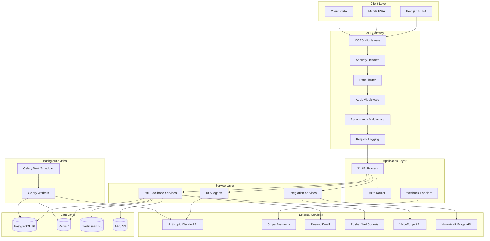
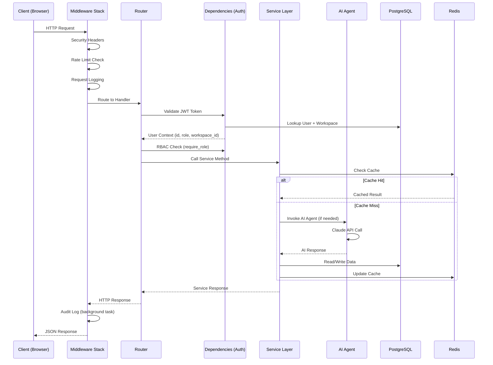
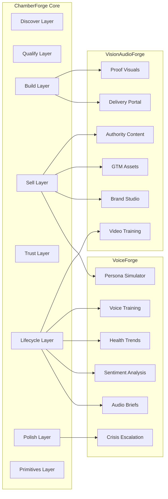

# ChamberForge System Architecture

## High-Level Architecture

## Request Data Flow

## 10 Platform Layers

| # | Layer | Modules | Description |
|---|-------|---------|-------------|
| 1 | **Discover** | 9 | Problem discovery, trend radar, evidence graph, AI scoring, wealth event monitor |
| 2 | **Qualify** | 9 | Validation, buyer profiling, guardrails, feasibility, risk queue, problem ontology engine |
| 3 | **Build** | 11 | Offer architect, pricing, SOPs, deal desk, trust pack, household graph |
| 4 | **Sell & Retain** | 14 | Copy, relationships, marketing, persona sim, retention, decision room, community intel network |
| 5 | **Trust & Compliance** | 5 | Consent ledger, AI explainability, QA, secure comms, benchmarks |
| 6 | **Client Lifecycle** | 9 | Intel briefs, health scoring, alumni, moat tracker, scenario planner |
| 7 | **Polish** | 4 | Template versioning, crisis console, cross-playbook composer, red-team |
| 8 | **Platform Primitives** | 7 | Entitlements, eval lab, rules engine, records governance, sandbox, runtime |
| 9 | **VoiceForge Integration** | 6 | Persona sim, audio briefs, crisis escalation, sentiment, training |
| 10 | **VisionAudioForge Integration** | 8 | Delivery portal, proof visuals, brand studio, GTM assets, video training |

**Total: 112 modules across 10 layers**

## Integration Architecture

## Technology Stack

| Component | Technology | Version | Purpose |
|-----------|-----------|---------|---------|
| Frontend | Next.js + TypeScript | 14.x | App Router SPA with SSR |
| Styling | Tailwind CSS | 3.x | Utility-first CSS |
| Backend | FastAPI (Python) | 0.115.x | Async REST API |
| ORM | SQLAlchemy | 2.x | Database ORM + migrations |
| Database | PostgreSQL | 16 | Primary data store (29 tables) |
| Cache / Queue | Redis | 7 | Caching, rate limiting, Celery broker |
| Search | Elasticsearch | 8.17 | Full-text search across entities |
| AI Engine | Anthropic Claude API | Claude 3+ | 10 specialized AI agents |
| Auth | JWT (python-jose) | - | Access + refresh tokens |
| Password Hashing | bcrypt (passlib) | - | Password storage |
| Encryption | Fernet (cryptography) | - | AES-256 field-level encryption |
| Payments | Stripe | - | Subscriptions, invoices, payouts |
| Email | Resend | - | Transactional + templated emails |
| Realtime | Pusher | - | WebSocket notifications |
| File Storage | AWS S3 + CloudFront | - | Document storage + CDN |
| Background Jobs | Celery + Redis | - | Async task processing |
| Monitoring | Sentry + Datadog | - | Error tracking + APM |
| Containerization | Docker + Docker Compose | - | Local dev + production deploy |
| CI/CD | GitHub Actions | - | Automated testing + deployment |
| Deploy | AWS ECS + RDS | - | Production infrastructure |

## Database Schema Overview (29 Tables)

### Core Entities

| Table | Description | Key Relationships |
|-------|-------------|-------------------|
| `users` | Platform users with roles | belongs_to workspace |
| `workspaces` | Multi-tenant workspace isolation | has_many users, problems, offers |
| `clients` | HNW/UHNW client records | belongs_to workspace, has household_graph |

### Discover Layer

| Table | Description | Key Relationships |
|-------|-------------|-------------------|
| `problems` | Pain point discoveries | belongs_to workspace, has_many evidence |
| `evidence` | Supporting evidence with credibility scores | links_to problems |

### Build Layer

| Table | Description | Key Relationships |
|-------|-------------|-------------------|
| `offers` | Premium service offer architectures | belongs_to workspace, links_to problems |
| `household_graphs` | Family/staff/property relationship graphs | belongs_to client |

### Sell & Billing

| Table | Description | Key Relationships |
|-------|-------------|-------------------|
| `subscriptions` | Stripe subscription records | belongs_to workspace |
| `invoices` | Invoice records | belongs_to workspace |
| `referrals` | Partner referral tracking | belongs_to workspace |

### Trust & Compliance

| Table | Description | Key Relationships |
|-------|-------------|-------------------|
| `consent_records` | GDPR/CCPA consent ledger | belongs_to client |
| `deletion_requests` | Right-to-deletion requests | belongs_to workspace |
| `legal_holds` | Legal hold records | belongs_to workspace |
| `secure_messages` | Compliant communications | belongs_to workspace |
| `audit_logs` | Immutable mutation audit trail | belongs_to workspace, user |

### Platform Operations

| Table | Description | Key Relationships |
|-------|-------------|-------------------|
| `notifications` | User notification center | belongs_to user |
| `documents` | File metadata (S3 references) | belongs_to workspace |
| `email_logs` | Email send history | belongs_to workspace |
| `crisis_incidents` | Crisis management records | belongs_to workspace |
| `risk_reviews` | Risk review queue items | belongs_to workspace |
| `template_versions` | Content template version history | belongs_to workspace |
| `prompt_versions` | AI prompt version management | system-wide |
| `feature_flags` | Feature flag configuration | system-wide or workspace |
| `automation_rules` | Rules engine configuration | belongs_to workspace |
| `ai_usage_logs` | AI cost and usage tracking | belongs_to workspace |

### Playbook System

| Table | Description | Key Relationships |
|-------|-------------|-------------------|
| `playbooks` | 10 vertical playbook templates | system-wide |
| `playbook_activations` | Workspace playbook activations | belongs_to workspace, playbook |
| `onboarding_progress` | User onboarding wizard state | belongs_to user |

### Portal

| Table | Description | Key Relationships |
|-------|-------------|-------------------|
| `client_portal_access` | White-label client portal tokens | belongs_to client |
